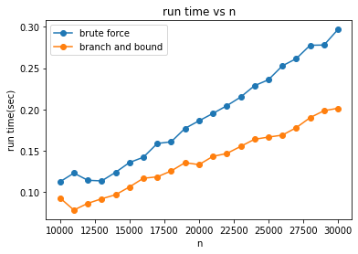

# selection-problem
Solve selection problem using prune and search or quick sort.

Homework of National Tsing Hua University (NTHU) 109 20 CS 431100 Design and Analysis of Algorithms

* 

* Set use_input_txt = 1 if you want to use input from file, or set use_input_txt = 0 to auto generate input data.
* Upload input.txt to current directory at the "Files" bar on the left 
* Click "Runtime" and "Run all" and see the output file QS.txt and PS.txt in current directory

